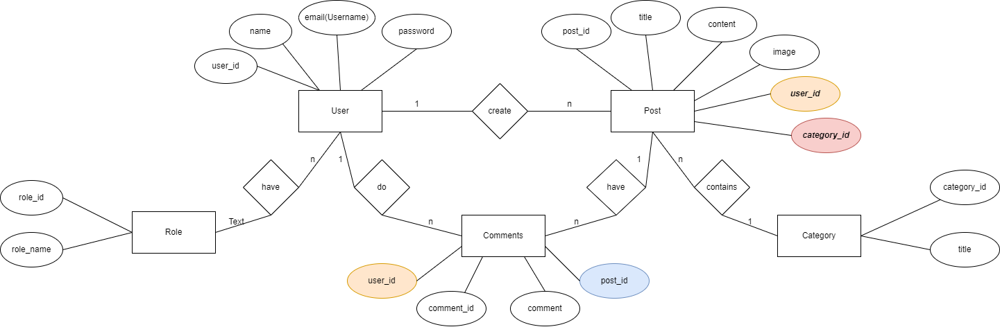

# **Bloggin Application API's Using Spring Boot 3.0.6**
The Blogging Application's REST API is a web-based platform that empowers bloggers and users to share their ideas and perspectives in an interactive way. The API allows users to publish blogs on their personal profiles, complete with image support, which enhances the user experience. The API also enables users to view and search for blogs and blog categories that align with their personal interests, fostering a community-driven platform. Users can also leave comments on published posts, encouraging engagement.

The API uses standard HTTP methods to retrieve, create, update, and delete data, providing a secure and robust way for the Blogging Application to interact with the data, making it easy and safe for users to share their thoughts and ideas. This REST API is an ideal solution for anyone who wants to connect with others and share their ideas through blogging.

## Features
- The API implements Spring Security and JSON Web Token (J.W.T) for authentication, validation, and authorization of users and administrators.
- The API includes functionality for pagination, sorting, and searching of data.
- The API implements custom exception handling for all exceptions and validations.
- The API utilizes custom request and response data transfer objects for all HTTP requests.
- The API's primary objective is to provide a streamlined and user-friendly blogging experience for users.
- Built on REST Architecture
- Consumable by clients that support HTTP Protocol
- Can be integrated with any application that supports REST API
- Suitable for a wide range of use cases.

## Tech Stack
- JAVA
- SPRING
- SPRINGBOOT
- HIBERNATE
- MAVEN
- J.D.B.C
- MYSQL
- POSTMAN

## Dependencies
- JWT AUTHENTICATION
- SPRING SECURITY
- SPRING DATA JPA
- SPRING BOOT DEVTOOLS
- SPRING WEB
- HIBERNATE
- MYSQL DRIVER
- VALIDATION
- LOMBOK

## User Functionalities

- Authentication Management

  - Endpoint for Sign Up
  - Endpoint for Sign In
  
- Profile Management

  - Endpoint for Updating User Information
  - Endpoint for Retrieving User Information
  - Endpoint for Deleting User Account
  
- Post Management

  - Endpoint for Creating Posts
  - Endpoint for Updating Posts
  - Endpoint for Retrieving Posts
  - Endpoint for Deleting Posts
  - Endpoint for Adding Comments to Posts
  - Endpoint for Updating Post Images
  - Endpoint for Retrieving Posts with Custom Pagination
  
- Category Management

  - Endpoint for Creating Categories
  - Endpoint for Updating Categories
  - Endpoint for Retrieving Categories
  - Endpoint for Deleting Categories
  
- **Searching & Sorting Posts**

  - Endpoint for Searching Posts by :
  
    - Title
    - Date
    - Category
    
  - Endpoint for Sorting Posts by :
  
    - Date
    - Popularity

  - User Search
    - Endpoint for Searching Users by :
      - Name
## Entity Relation (ER) Diagram


## API Reference
## Authorization & Authentication API Reference

- Register **POST**
```
http://localhost:8080/api/v1/auth/register
```
Request Body
```
{
    "name":"Vivek Shinde",
    "email":"vivek@mail.in",
    "password":"1234"
}
```

- Authenticate **POST**
```
http://localhost:8080/api/v1/auth/authenticate
```
Request Body
```
{
    "username":"vivek@mail.in",
    "password":"1234"
}
```

## User API Reference

- Register **POST**
```
http://localhost:8080/api/user/
```
Request Body
```
{
    "name": "Vivek",
    "email": "vivek@mail.in",
    "password": "Mail@2023",
    "about": "Hello ..."
}
```

- Update **PUT**

```
http://localhost:8080/api/user/2
```
Request Body
```
{
    "name": "Vivek",
    "email": "vivek@mail.in",
    "password": "Mail@2023",
    "about": "Hello ..."
}
```

- Delete **DELETE**
```
http://localhost:8080/api/user/2
```

- Get Single User **GET**
```
http://localhost:8080/api/user/1
```

- Get All Users **GET**
```
http://localhost:8080/api/user/
```

- Get User by Pagination **GET**
```
http://localhost:8080/api/user/page?pageNumber=0&pageSize=2
```

## Post API Reference
- Create Post **POST**
```
http://localhost:8080/api/user/1/category/4/posts
```
Request Body
```
{
    "title":"What java is not pure OOPs?",
    "content":"Because it contains primitive data types"
}
```
- Update Post **PUT**

```
http://localhost:8080/api/posts/3
```
Request Body
```
{
    "title": "What java is not pure OOPs?",
    "content": "Because it contains primitive data types",
    "imgName": "hello.png"
}
```
- Delete Post **DELETE**
```
http://localhost:8080/api/posts/3
```

- Get post by ID **GET**
```
http://localhost:8080/api/posts/3
```

- Get all posts **GET**
```
http://localhost:8080/api/posts/
```

- Get posts by User **GET**
```
http://localhost:8080/api/user/1/posts
```

- Get posts by Category **GET**
```
http://localhost:8080/api/category/2/posts
```

- Get Post by pages **GET**
```
http://localhost:8080/api/posts?pageNumber=0&pageSize=5&sortBy=content&sortDir=asc
```

- Get All post by search keyword **GET**
```
http://localhost:8080/api/posts/search/{keyword}
```

## Category API Reference

- Create **POST**
```
http://localhost:8080/api/category/
```
Request Body
```
{
    "categoryName":"Technology",
    "categoryDescription":"All tech related article can match this category"
}
```

- Update **PUT**
```
http://localhost:8080/api/category/1
```
Request Body
```
{
    "categoryName":"Cricker",
    "categoryDescription":"Mumbai Indians is greatest team of IPL ever"
}
```

- Delete **DELETE**
```
http://localhost:8080/api/category/1
```

- Get Single Categories **GET**
```
http://localhost:8080/api/category/1
```

- Get Categories **GET**
```
http://localhost:8080/api/category/
```

- Get Categories by page **GET**
```
http://localhost:8080/api/category/page?pageNumber=0&pageSize=2
```

## Comment API Reference

- Create **POST**
```
http://localhost:8080/api/comment/user/1/post/1
```
Request Body
```
{
    "content":"first comment"
}
```

- Delete **POST**
```
http://localhost:8080/api/comment/54
```


## Authors
- [Vivek Shinde](https://github.com/vivekshinde45)

## Acknowledgements
- [Learn Code With Durgesh](https://www.youtube.com/@LearnCodeWithDurgesh) 
